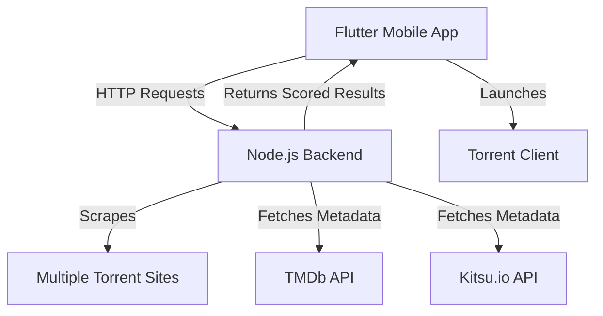

<div align="center">

<!-- App Logo -->


### *The Intelligent Torrent Discovery Engine*


*One tap. Best torrent. Every time.*

[🚀 Quick Start](#-quick-start) • [📱 Features](#-features) • [🏗️ Architecture](#️-architecture) • [🎨 Screenshots](#-screenshots)

</div>

---

## 🎨 Screenshots

<div align="center">

### 🌟 App Interface Showcase

<table>
  <tr>
    <td align="center">
      
      <br>
      <sub><b>Home Screen</b></sub>
    </td>
    <td align="center">
      
      <br>
      <sub><b>Search Results</b></sub>
    </td>
    <td align="center">
      
      <br>
      <sub><b>Loading Animation</b></sub>
    </td>
  </tr>
  <tr>
    <td align="center">
      
      <br>
      <sub><b>Movie Details</b></sub>
    </td>
    <td align="center">
      
      <br>
      <sub><b>Anime Search</b></sub>
    </td>
    <td align="center">
      
      <br>
      <sub><b>Torrent Selection</b></sub>
    </td>
  </tr>
</table>

> 📱 **Interactive Demo:** Experience the fluid animations and smooth transitions that make Tory a joy to use.

</div>

---

## 🌟 Overview

Tory revolutionizes torrent discovery by combining intelligent scoring algorithms with a beautiful, animated interface. Built for movie enthusiasts and anime lovers, it automatically finds the highest-quality torrents from multiple sources and delivers them through a seamless one-tap experience.

> **🎯 Smart Discovery:** Goes beyond simple seeder counts using multi-factor analysis inspired by Radarr's sophisticated scoring system.

## 📱 Features

### 🔍 **Intelligent Search Engine**
- **Multi-Source Aggregation** — Searches across multiple public indexers simultaneously
- **Advanced Scoring Algorithm** — Evaluates quality, source type, audio, and health metrics
- **Category Specialization** — Dedicated scrapers for movies and anime content

### 🎨 **Beautiful Interface**
- **Fluid Animations** — Custom Flutter animations with staggered list effects
- **Adaptive Design** — Collapsing search bars and smooth state transitions
- **Rich Content Display** — High-quality posters from TMDb and Kitsu.io

### ⚡ **Instant Action**
- **One-Tap Launch** — Direct magnet link integration with torrent clients
- **Smart Filtering** — Configurable file size limits and quality preferences
- **Fallback Support** — Clipboard copy when no torrent client is available

## 🏗️ Architecture



### Backend (Node.js + Express)
- **RESTful API** with `/search` endpoint
- **Parallel Processing** for multiple torrent sources
- **Custom Scoring Engine** with quality metrics
- **Metadata Enrichment** from external APIs

### Frontend (Flutter)
- **Cross-Platform** mobile application
- **State Management** with StatefulWidget pattern
- **Animation Framework** leveraging Flutter's built-in capabilities
- **URL Launcher** integration for seamless torrent client handoff

## 🚀 Quick Start

### Prerequisites

```bash
# Required tools
- Node.js (LTS version)
- Flutter SDK 3.0+
- TMDb API Key
- VPN connection (recommended)
```

### 1️⃣ Backend Setup

```bash
# Navigate to server directory
cd torrent_bot_server

# Install dependencies
npm install

# Configure API key in server.js
const TMDB_API_KEY = 'your_tmdb_api_key_here';

# Start server (with VPN active)
node server.js
```

Server runs on `http://localhost:3000`

### 2️⃣ Flutter App Setup

```bash
# Navigate to app directory
cd movie_finder_app

# Get dependencies
flutter pub get

# Configure server endpoint in lib/main.dart
final authority = 'your_server_address:3000';

# Launch app
flutter run
```

## 🎯 Usage

<div align="center">

### 🚀 Demo Video


*Watch Tory in action - from search to launch in seconds*

</div>

1. **Launch** the Tory app on your device
2. **Search** for any movie or anime title
3. **Filter** results by maximum file size if needed
4. **Tap** on your preferred torrent to launch instantly
5. **Enjoy** automatic opening in your torrent client

## ⚙️ Configuration

### Server Endpoints
| Endpoint | Method | Description |
|----------|--------|-------------|
| `/search` | POST | Main search functionality with scoring |

### Environment Variables
```env
TMDB_API_KEY=your_tmdb_v3_api_key
PORT=3000
```

### Device-Specific Settings

**Android Emulator:** `10.0.2.2:3000`  
**Desktop/Web:** `localhost:3000`  
**Physical Device:** `192.168.x.x:3000` (your local IP)

## 🛠️ Development

### Project Structure
```
tory/
├── movie_finder_app/          # Flutter mobile application
│   ├── lib/
│   │   ├── main.dart          # Main app entry point
│   │   └── ...
│   └── pubspec.yaml
├── torrent_bot_server/        # Node.js backend server
│   ├── server.js              # Express server
│   ├── package.json
│   └── ...
└── README.md
```

### Key Dependencies

**Backend:**
- `express` - Web framework
- `axios` - HTTP client
- `cheerio` - HTML parsing
- `torrent-search-api` - Torrent indexing

**Frontend:**
- `http` - Network requests
- `url_launcher` - External app integration
- `flutter_spinkit` - Loading animations

## 🤝 Contributing

We welcome contributions! Please see our [Contributing Guidelines](CONTRIBUTING.md) for details.

1. Fork the repository
2. Create your feature branch (`git checkout -b feature/amazing-feature`)
3. Commit your changes (`git commit -m 'Add amazing feature'`)
4. Push to the branch (`git push origin feature/amazing-feature`)
5. Open a Pull Request

## 📄 License

This project is licensed under the MIT License - see the [LICENSE](LICENSE) file for details.

## ⚠️ Disclaimer

**Educational Purpose Only:** This project is intended for educational and research purposes. Users are responsible for complying with all applicable laws and regulations in their jurisdiction. The developers do not endorse or encourage the downloading of copyrighted material without proper authorization.

---

<div align="center">

**Built with ❤️ by the Tory Team**

[⭐ Star this repo](https://github.com/yourusername/tory) if you found it helpful!

</div>